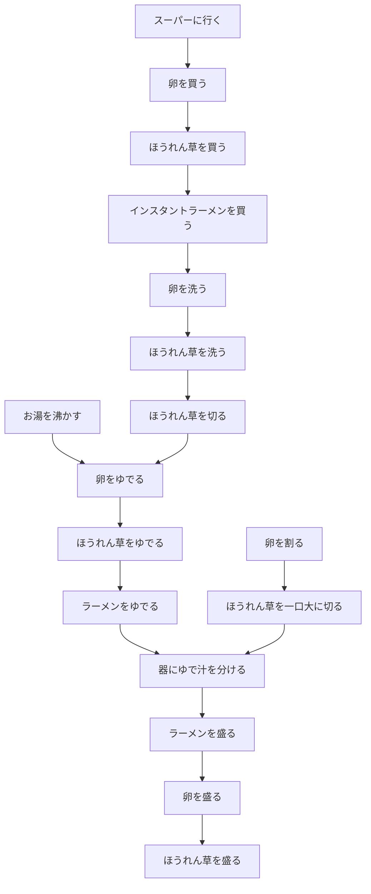

```mermaid
graph TB;
a1["スーパーに行く"]-->a2["卵を買う"]-->a3["ほうれん草を買う"]-->a4["インスタントラーメンを買う"]-->b1["卵を洗う"]-->b2["ほうれん草を洗う"]-->b3["ほうれん草を切る"]
b4["お湯を沸かす"]-->b5["卵をゆでる"]
b3-->b5
b5-->b6["ほうれん草をゆでる"]-->b7["ラーメンをゆでる"]-->b10
b8["卵を割る"]-->b9["ほうれん草を一口大に切る"]-->b10["器にゆで汁を分ける"]-->b11["ラーメンを盛る"]-->b12["卵を盛る"]-->b13["ほうれん草を盛る"]
```