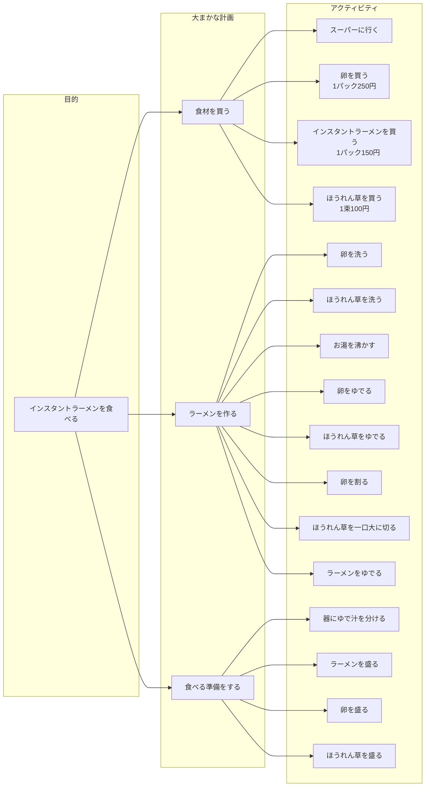

```mermaid
flowchart LR
    subgraph 目的
    a1["インスタントラーメンを食べる"]
    end
    subgraph 大まかな計画
    a1-->b1["食材を買う"];
    a1-->b2["ラーメンを作る"];
    a1-->b3["食べる準備をする"];
    end
    subgraph アクティビティ
    b1-->c1["スーパーに行く"];
    b1-->buy1["卵を買う
    1パック250円"];
    b1-->buy2["インスタントラーメンを買う
    1パック150円"];
    b1-->buy3["ほうれん草を買う
    1束100円"];

    b2-->cooking1["卵を洗う"];
    b2-->cooking4["ほうれん草を洗う"];
    b2-->cooking2["お湯を沸かす"];
    b2-->cooking3["卵をゆでる"];
    b2-->cooking5["ほうれん草をゆでる"];
    b2-->cooking6["卵を割る"];
    b2-->cooking7["ほうれん草を一口大に切る"];
    b2-->cooking8["ラーメンをゆでる"];

    b3-->c6["器にゆで汁を分ける"];
    b3-->c7["ラーメンを盛る"];
    b3-->c8["卵を盛る"];
    b3-->c9["ほうれん草を盛る"];
    end
```