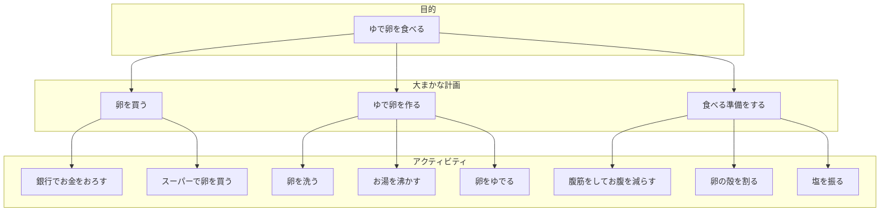

```mermaid
flowchart TB
    subgraph 目的
    a1["ゆで卵を食べる"]
    end
    subgraph 大まかな計画
    a1-->b1["卵を買う"];
    a1-->b2["ゆで卵を作る"];
    a1-->b3["食べる準備をする"];
    end
    subgraph アクティビティ
    b1-->c1["銀行でお金をおろす"];
    b1-->c2["スーパーで卵を買う"];

    b2-->c3["卵を洗う"];
    b2-->c4["お湯を沸かす"];
    b2-->c5["卵をゆでる"];

    b3-->c6["腹筋をしてお腹を減らす"];
    b3-->c7["卵の殻を割る"];
    b3-->c8["塩を振る"];
    end
```