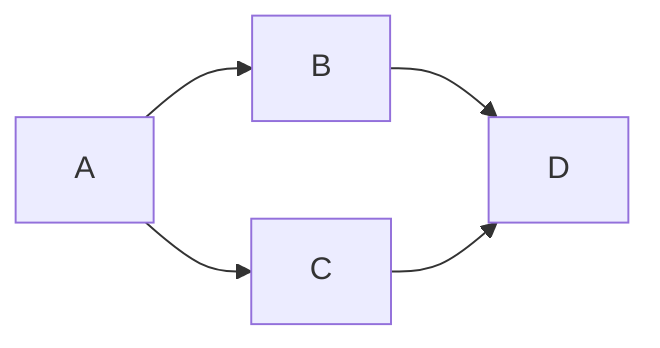
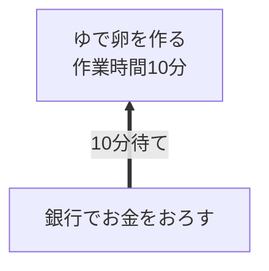
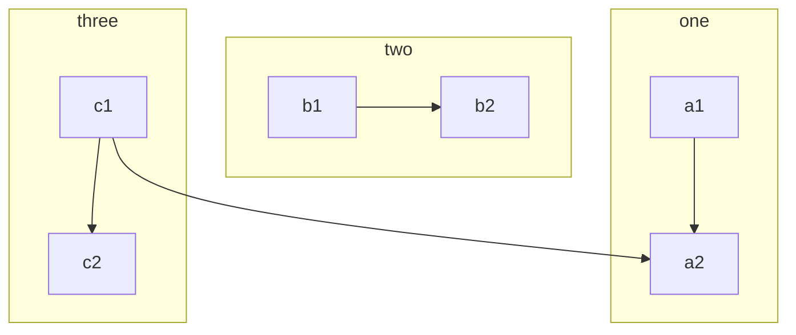

```mermaid
graph LR;
    A-->B;
    A-->C;
    B-->D;
    C-->D;
```

```mermaid
    graph BT;
    id1["銀行でお金をおろす"];
    egg["ゆで卵を作る
    作業時間10分"];
    id1==10分待て==>egg;
```

```mermaid
flowchart TB
    c1-->a2
    subgraph one
    a1-->a2
    end
    subgraph two
    b1-->b2
    end
    subgraph three
    c1-->c2
    end
```