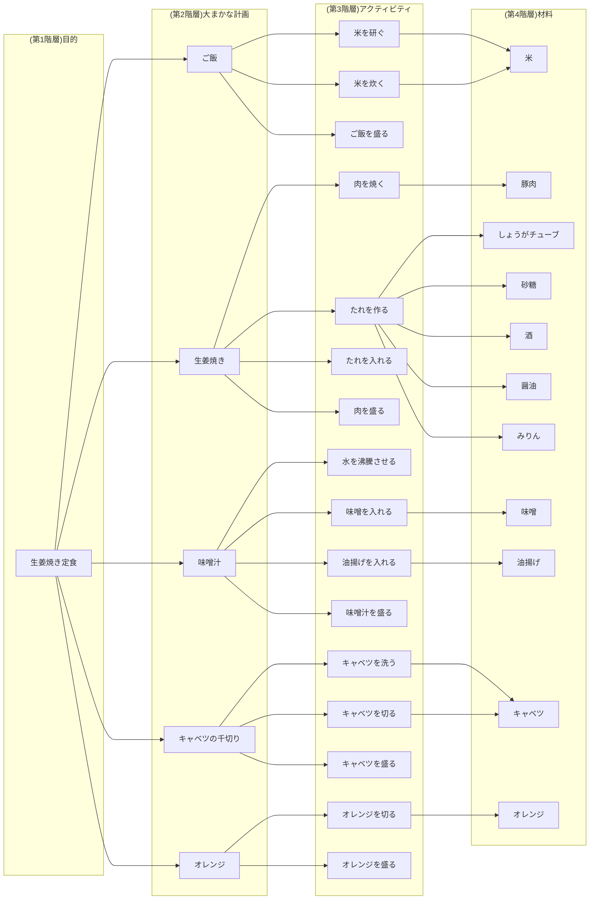

```mermaid
flowchart LR
subgraph "(第1階層)目的"
    id1["生姜焼き定食"]
end

subgraph "(第2階層)大まかな計画"
    id2["ご飯"]
    id3["生姜焼き"]
    id4["味噌汁"]
    id5["キャベツの千切り"]
    id6["オレンジ"]
end

subgraph "(第3階層)アクティビティ"
    id7["米を研ぐ"]
    id8["米を炊く"]
    id9["ご飯を盛る"]
    id10["肉を焼く"]
    id11["たれを作る"]
    id12["たれを入れる"]
    id13["肉を盛る"]
    id14["水を沸騰させる"]
    id15["油揚げを入れる"]
    id16["味噌を入れる"]
    id17["味噌汁を盛る"]
    id18["キャベツを洗う"]
    id19["キャベツを切る"]
    id20["キャベツを盛る"]
    id21["オレンジを切る"]
    id22["オレンジを盛る"]
end

subgraph "(第4階層)材料"
    id23["米"]
    id24["豚肉"]
    id25["しょうがチューブ"]
    id26["砂糖"]
    id27["酒"]
    id28["醤油"]
    id29["みりん"]
    id30["味噌"]
    id31["油揚げ"]
    id32["キャベツ"]
    id33["オレンジ"]
end

id1--->id2
id1--->id3
id1--->id4
id1--->id5
id1--->id6

id2--->id7
id2--->id8
id2--->id9

id3--->id10
id3--->id11
id3--->id12
id3--->id13

id4--->id14
id4--->id15
id4--->id16
id4--->id17

id5--->id18
id5--->id19
id5--->id20

id6--->id21
id6--->id22

id7--->id23
id8--->id23

id10--->id24
id11--->id25
id11--->id26
id11--->id27
id11--->id28
id11--->id29

id15--->id31
id16--->id30

id18--->id32
id19--->id32

id21--->id33
```